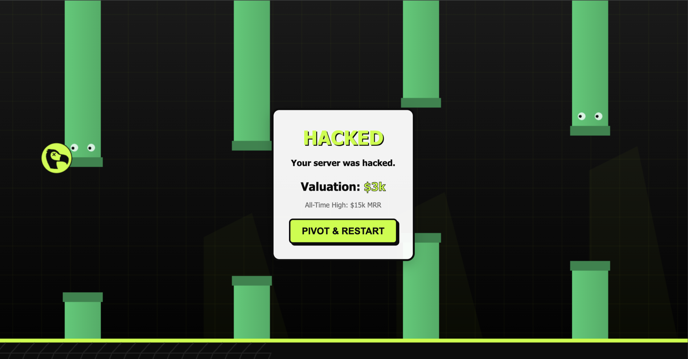

# Dodo Games

<p align="left">
  <a href="https://discord.gg/bYqAp4ayYh">
    
  </a>
  <a href="LICENSE">
    
  </a>
</p>

Dodo Games is an engaging collection of playful, custom-built games created by and for the Dodo Payments community.

## Games

**[Flappy Dodo](/flappy-dodo)** - A Flappy Bird-style game with a startup/business theme




## Local Development

### Running a Game Locally

Navigate to any game directory and open `index.html` in a web browser:

```bash
cd flappy-dodo
open index.html  # macOS
# or just open the file in your browser
```

### Building for Production

Run the build script from the root directory to build all games:

```bash
npm run build
```

This will:
- Minify all HTML, CSS, and JavaScript files
- Copy assets to the `dist` folder
- Prepare everything for Cloudflare Pages deployment

The output will be in the `dist/` directory with the following structure:
```
dist/
├── index.html          # Landing page
└── flappy-dodo/        # Game directory
    ├── index.html
    ├── style.css
    ├── script.js
    └── assets/
```

## Deploying to Cloudflare Pages

### Prerequisites

1. A Cloudflare account
2. Wrangler CLI installed (optional, for local preview):
   ```bash
   npm install -g wrangler
   ```

### Deployment Steps

#### Option 1: Deploy via Cloudflare Dashboard (Recommended)

1. **Build the project:**
   ```bash
   npm run build
   ```

2. **Go to Cloudflare Dashboard:**
   - Navigate to [Cloudflare Dashboard](https://dash.cloudflare.com/)
   - Go to **Workers & Pages** → **Create application** → **Pages** → **Connect to Git**

3. **Connect your repository:**
   - Select your Git provider (GitHub, GitLab, or Bitbucket)
   - Authorize Cloudflare to access your repository
   - Select the `dodo-games` repository

4. **Configure build settings:**
   - **Project name:** `dodo-games` (or your preferred name)
   - **Production branch:** `main`
   - **Build command:** `npm run build`
   - **Build output directory:** `dist`
   - **Root directory:** `/` (leave empty or set to root)

5. **Configure custom domain:**
   - After deployment, go to **Custom domains**
   - Add `games.dodopayments.com`
   - Follow DNS configuration instructions

6. **Deploy:**
   - Click **Save and Deploy**
   - Cloudflare will automatically build and deploy your site

#### Option 2: Deploy via Wrangler CLI

1. **Install Wrangler (if not already installed):**
   ```bash
   npm install -g wrangler
   ```

2. **Login to Cloudflare:**
   ```bash
   wrangler login
   ```

3. **Build the project:**
   ```bash
   npm run build
   ```

4. **Deploy:**
   ```bash
   wrangler pages deploy dist --project-name=dodo-games
   ```

### Setting Up Custom Domain

1. In Cloudflare Dashboard, go to your Pages project
2. Navigate to **Custom domains**
3. Click **Set up a custom domain**
4. Enter `games.dodopayments.com`
5. Add the CNAME record to your DNS:
   - **Type:** CNAME
   - **Name:** `games`
   - **Target:** Your Cloudflare Pages domain (e.g., `dodo-games.pages.dev`)
   - **Proxy status:** Proxied (orange cloud)

### URL Structure

After deployment, games will be accessible at:
- Landing page: `https://games.dodopayments.com/`
- Dodo Flappy: `https://games.dodopayments.com/flappy-dodo`

### Adding New Games

1. Create a new folder in the root directory (e.g., `game-2/`)
2. Add your game files (`index.html`, `script.js`, `style.css`, `assets/`, etc.)
3. Update the root `index.html` to include a link to your new game
4. Run `npm run build` to include it in the build
5. Deploy to Cloudflare Pages

The build script automatically detects any directory with an `index.html` file and includes it in the build.

## Project Structure

```
dodo-games/
├── index.html          # Landing page listing all games
├── package.json        # NPM configuration
├── build.js            # Build script for all games
├── wrangler.toml       # Cloudflare Pages configuration
├── README.md           # This file
└── flappy-dodo/        # Game directory
    ├── index.html
    ├── script.js
    ├── style.css
    ├── assets/
    └── README.md
```

## Development Tips

- Each game should be self-contained in its own directory
- Use relative paths for assets (e.g., `assets/image.svg`)
- The build script automatically minifies all files
- Test locally before deploying

